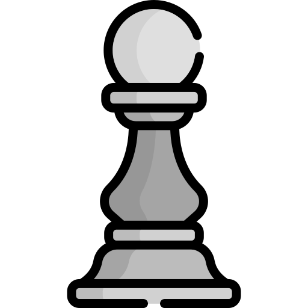
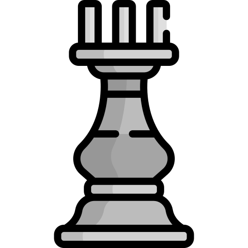

<h1>
  
</h1>
 

  
    
  <samp align="right">
  I design and develop, landing pages and applications for startups and enterprises. 
     
  </samp>

  ---
  
  

  

 
### Boy Scout Rule

I love open source.  I am not a heavy maintainer of any large libraries, but I really like the boyscout rule.  I contribute to things as I come across issues that I think other people might struggle with.  This may be things that are overlooked by someone who is deep into the library. I 💕 a good onboarding readme with good example.

 ---

### My Digital Garden 🌱

I write regular blog posts, most of which you will find on my personal website [aland-mariwan.de](https://aland-mariwan.de).

I write about things I am familiar with, things that trip up folks that I mentor, and things that I am learning.  Day to day I make things with **data** using **python** and **javascript**. 

[Latest Post 👉](https://aland-mariwan.de/blog.php)

 ---
 

<h2> 👨🏽‍💻Talking about Personal Stuffs:</h2>

👨🏻‍🎓 I am currently studying in osz teltow; 😊 I'm a lifelong learner; ⚡ Fun fact: I like to Singing Rap 🎧 , And Read Books 📕 About Security & Hacking And I love Play Independent games 🎮; 👯 I’m looking to collaborate on open source or any commercial project; 💬 Ask me about anything, I am happy to help;

## What I like:
I love coding in python for many reasons. Here are some:
  * Simple syntax
  * Ability to do a lot with just a few lines of code
  * Makes automization really easy  
  
I also like listening to music while coding. It helps me relax  
and (or) concentrate a lot.
I need to be organized all the time so I usually have most of my day written  
down somewhere so that I don't get lost in my thought - this kind of means I like  
being organized?  
  
I also like coding in Java because:
 * I can create minecraft mods, which are fun and people like to use them
 * Really interesting to me, I like the syntax  
 * Can be challenging and still look great even with more complicated syntax

-------

  

<!-- 
 -->

------------

This is an open chess tournament where ANYONE can play. That's the fun part.
It's your turn to play! Move a black piece.

<!-- BEGIN CHESS BOARD -->
|   | A | B | C | D | E | F | G | H |   |
|---|:-:|:-:|:-:|:-:|:-:|:-:|:-:|:-:|:-:|
| **8** |  |  |  |  |  |  |  |  | **8** |
| **7** |  |  |  |  |  |  |  |  | **7** |
| **6** |  |  |  |  |  |  |  |  | **6** |
| **5** |  |  |  |  |  |  |  |  | **5** |
| **4** |  |  |  |  |  |  |  |  | **4** |
| **3** |  |  |  |  |  |  |  |  | **3** |
| **2** |  |  |  |  |  |  |  |  | **2** |
| **1** |  |  |  |  |  |  |  |  | **1** |
|   | **A** | **B** | **C** | **D** | **E** | **F** | **G** | **H** |   |
<!-- END CHESS BOARD -->

**It's your turn to move! Choose one from the following table**
<!-- BEGIN MOVES LIST -->
|  FROM  | TO (Just click a link!) |
| :----: | :---------------------- |
| **A2** | [A3](https://github.com/marcizhu/marcizhu/issues/new?body=Please+do+not+change+the+title.+Just+click+%22Submit+new+issue%22.+You+don%27t+need+to+do+anything+else+%3AD&title=Chess%3A+Move+A2+to+A3), [A4](https://github.com/marcizhu/marcizhu/issues/new?body=Please+do+not+change+the+title.+Just+click+%22Submit+new+issue%22.+You+don%27t+need+to+do+anything+else+%3AD&title=Chess%3A+Move+A2+to+A4) |
| **B1** | [A3](https://github.com/marcizhu/marcizhu/issues/new?body=Please+do+not+change+the+title.+Just+click+%22Submit+new+issue%22.+You+don%27t+need+to+do+anything+else+%3AD&title=Chess%3A+Move+B1+to+A3), [C3](https://github.com/marcizhu/marcizhu/issues/new?body=Please+do+not+change+the+title.+Just+click+%22Submit+new+issue%22.+You+don%27t+need+to+do+anything+else+%3AD&title=Chess%3A+Move+B1+to+C3) |
| **B2** | [B3](https://github.com/marcizhu/marcizhu/issues/new?body=Please+do+not+change+the+title.+Just+click+%22Submit+new+issue%22.+You+don%27t+need+to+do+anything+else+%3AD&title=Chess%3A+Move+B2+to+B3), [B4](https://github.com/marcizhu/marcizhu/issues/new?body=Please+do+not+change+the+title.+Just+click+%22Submit+new+issue%22.+You+don%27t+need+to+do+anything+else+%3AD&title=Chess%3A+Move+B2+to+B4) |
| **C2** | [C3](https://github.com/marcizhu/marcizhu/issues/new?body=Please+do+not+change+the+title.+Just+click+%22Submit+new+issue%22.+You+don%27t+need+to+do+anything+else+%3AD&title=Chess%3A+Move+C2+to+C3), [C4](https://github.com/marcizhu/marcizhu/issues/new?body=Please+do+not+change+the+title.+Just+click+%22Submit+new+issue%22.+You+don%27t+need+to+do+anything+else+%3AD&title=Chess%3A+Move+C2+to+C4) |
| **D2** | [D3](https://github.com/marcizhu/marcizhu/issues/new?body=Please+do+not+change+the+title.+Just+click+%22Submit+new+issue%22.+You+don%27t+need+to+do+anything+else+%3AD&title=Chess%3A+Move+D2+to+D3), [D4](https://github.com/marcizhu/marcizhu/issues/new?body=Please+do+not+change+the+title.+Just+click+%22Submit+new+issue%22.+You+don%27t+need+to+do+anything+else+%3AD&title=Chess%3A+Move+D2+to+D4) |
| **E2** | [E3](https://github.com/marcizhu/marcizhu/issues/new?body=Please+do+not+change+the+title.+Just+click+%22Submit+new+issue%22.+You+don%27t+need+to+do+anything+else+%3AD&title=Chess%3A+Move+E2+to+E3), [E4](https://github.com/marcizhu/marcizhu/issues/new?body=Please+do+not+change+the+title.+Just+click+%22Submit+new+issue%22.+You+don%27t+need+to+do+anything+else+%3AD&title=Chess%3A+Move+E2+to+E4) |
| **F2** | [F3](https://github.com/marcizhu/marcizhu/issues/new?body=Please+do+not+change+the+title.+Just+click+%22Submit+new+issue%22.+You+don%27t+need+to+do+anything+else+%3AD&title=Chess%3A+Move+F2+to+F3), [F4](https://github.com/marcizhu/marcizhu/issues/new?body=Please+do+not+change+the+title.+Just+click+%22Submit+new+issue%22.+You+don%27t+need+to+do+anything+else+%3AD&title=Chess%3A+Move+F2+to+F4) |
| **G1** | [F3](https://github.com/marcizhu/marcizhu/issues/new?body=Please+do+not+change+the+title.+Just+click+%22Submit+new+issue%22.+You+don%27t+need+to+do+anything+else+%3AD&title=Chess%3A+Move+G1+to+F3), [H3](https://github.com/marcizhu/marcizhu/issues/new?body=Please+do+not+change+the+title.+Just+click+%22Submit+new+issue%22.+You+don%27t+need+to+do+anything+else+%3AD&title=Chess%3A+Move+G1+to+H3) |
| **G2** | [G3](https://github.com/marcizhu/marcizhu/issues/new?body=Please+do+not+change+the+title.+Just+click+%22Submit+new+issue%22.+You+don%27t+need+to+do+anything+else+%3AD&title=Chess%3A+Move+G2+to+G3), [G4](https://github.com/marcizhu/marcizhu/issues/new?body=Please+do+not+change+the+title.+Just+click+%22Submit+new+issue%22.+You+don%27t+need+to+do+anything+else+%3AD&title=Chess%3A+Move+G2+to+G4) |
| **H2** | [H3](https://github.com/marcizhu/marcizhu/issues/new?body=Please+do+not+change+the+title.+Just+click+%22Submit+new+issue%22.+You+don%27t+need+to+do+anything+else+%3AD&title=Chess%3A+Move+H2+to+H3), [H4](https://github.com/marcizhu/marcizhu/issues/new?body=Please+do+not+change+the+title.+Just+click+%22Submit+new+issue%22.+You+don%27t+need+to+do+anything+else+%3AD&title=Chess%3A+Move+H2+to+H4) |
<!-- END MOVES LIST -->

| Move | Author |
| :--: | :----- |
| | |

<!-- END LAST MOVES -->

Having fun? Ask a friend to do the next move!

How it works
When you click on a link and submit a new issue with the desired move, a GitHub action is triggered, which in turn runs a small python script that performs the specified movement, updates this README file and commits the changes.

-----------

This <i>README</i> file is generated <b>every 3 hours</b>! Last refresh: Thursday, 25 November, 19:05 CET 

  

