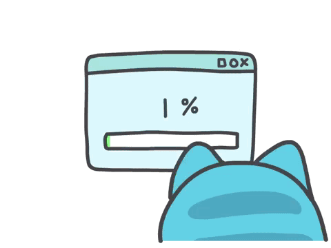
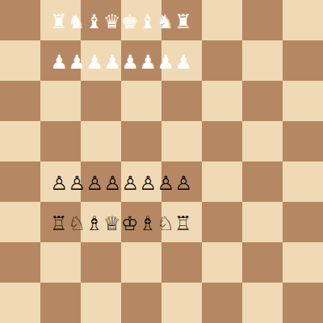

  

  <h1>
    
  </h1>

  <strong>
    AI Engineer • Full-Stack Developer • Open Source • Automation
  </strong>

  I build intelligent software, automate workflows and create tools that make developers more productive.

---

## 🌍 Open Source

I enjoy contributing to open source whenever I can.

One principle I always follow:

> **Leave every codebase better than you found it.**

Whether it's fixing bugs, improving documentation, or making onboarding easier—I enjoy making projects better for everyone.

 

---

## 🌱 Digital Garden

I enjoy sharing what I learn.

On **tasiomind.dev** I write about:

- 🤖 Artificial Intelligence
- ⚙️ Software Engineering
- ☁️ Cloud & DevOps
- 🚀 Developer Experience
- 🔄 Automation

📖 **Website:** https://tasiomind.dev

✍️ **Blog:** https://tasiomind.dev/blog

---

## 👨‍💻 About Me

- 🤖 Building AI applications & autonomous agents
- ☁️ Passionate about Cloud Native systems
- ⚙️ Automation enthusiast
- 📚 Lifelong learner
- 🎧 Music keeps me in the flow
- 🎮 Indie games & security books
- 🤝 Always happy to collaborate

 

---

## 🚀 Current Focus

- AI Agents
- Multi-Agent Systems
- MCP
- LLM Infrastructure
- Cloud Native
- Open Source

### 💭 Philosophy

> **Think before you build.**
>
> Great software isn't about writing more code—it's about solving the right problem with the simplest solution.

---

     

---

     

---

    

